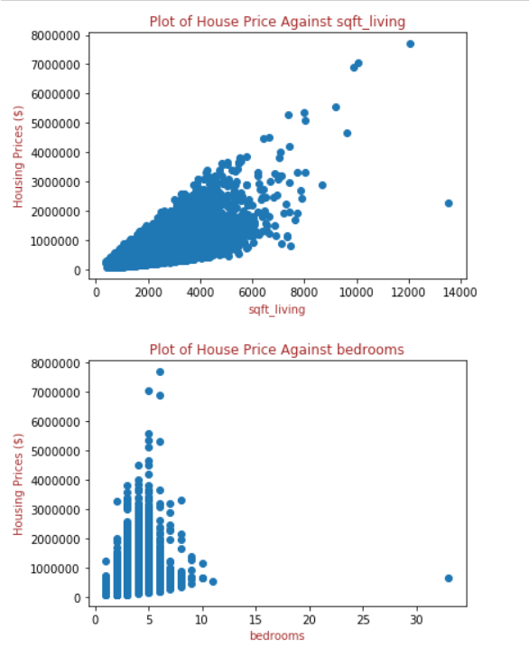
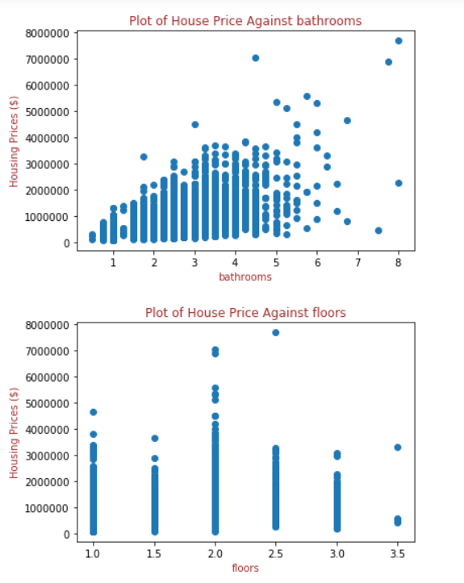

# King County Home Remodeling

Author: James Stipanowich

## Project Overview

Every year many homes are bought and sold in Washington state. Seattle, the largest city in Washington state, belongs to a county named King County. The buying and selling of houses occurs every year in King County in mass quantities because King County happens to be the most populous county in Washington state and the 12th most populous county in the United States (information obtained from https://en.wikipedia.org/wiki/King_County,_Washington). Each year vast amounts of home selling price values get recorded in King County and vary from high thousands to millions of dollars. The monetary worth of a house can depend on many factors that include square footage, number of bedrooms, number of bathrooms, and number of floors of a home. Regression modeling is implemented in King County, a county with enormous potential for home sales, to assess home value and to inform a home seller how to sell a home for the greatest net worth possible.

## Business Problem

In this housing project, I am acting with a real estate agency in the King County area of Washington state. The real estate agency wants to help homeowners determine the best ways to improve their homes and enhance the estimated value of their homes in preparation for putting them on the market to be sold. I plan to help homeowners come up with the best ideas for home renovations to increase the worth of their homes and allow homeowners to sell their homes for the highest monetary value possible.

### The Data

This project uses the King County House Sales dataset, which can be found in  `kc_house_data.csv` in the data folder in this repository. The description of the column names can be found in `column_names.md` in the same folder. The dataset covers house sale prices between May 2014 and May 2015 in King County of Washington state.

I decided what data from this dataset to use and how to use it. 

## Data Preparation

Factors that influence how well a house might sell in King County include square footage, number of bedrooms, number of bathrooms, and number of floors of a home. I used these specific home aspects from the King County House Sales dataset because they are all variables that can be realistically constructed or deconstructed in order to improve the selling price of a home. I created graphs of the relationships between these attributes of homes in King County and the sale prices of these homes in King County to connect how home sale price and the various attributes affect one another. The graphs are shown below:

The graphs show the relationships between these various features of a home and home sale price on different scales. Each of these home variables links with home sale price in a unique way.

## Data Modeling

In order to take into account square footage, number of bedrooms, number of bathrooms, and number of floors of a home on a collective scale with a more specified affiliation with home sale price, I created a model including all of these aspects of home sales and compared the various model features with home selling price. My initial model used square footage, number of bedrooms, number of bathrooms, and number of floors of a home as they existed unchanged in the dataset and ended up with a .52 test R2 score (medium amount of variation in the data). 

The initial model had linear coefficients that exhibit square footage had the strongest positive relationship with home sale price of the features. Number of bedrooms had a negative relationship with home sale price. Number of floors and number of bathrooms both had minor positive relationships with home sale price. The first model test set had a root mean squared error value of 258699.74, which means my model could be about 258699.74 dollars off of my target home selling price. My baseline model included a lot of outlier data that may have strongly skewed the relationships between the various features of square footage, number of bedrooms, number of bathrooms, and number of floors of a home and home selling price. 

I created a second model that mitigated the outlier data. I changed the number of bedrooms and bathrooms per house to less than or equal to 6. This data mostly represents single family households. I altered the number of floors in the data to only include houses with three floors or less. I reinstated a new home selling price ceiling of 1275032.85 dollars to include only homes whose initial home price value was within two standard deviations of the mean home price value. The changes I made allowed my new model to receive a .42 test R2 score (still medium variability in the data).

The second model had linear coefficients that exhibit square footage still had the strongest positive relationship with home sale price. Number of bedrooms still had a negative relationship with home sale price.  Number of bathrooms had a minor negative relationship with home sale price. Number of floors had a minor positive relationship with home sale price. The second model test set had a root mean square error value of 169711.26, which means my model could be about 169711.26 dollars off of my target home selling price.

I attempted a third model using a log transforming of housing price to determine if my model house prices could fit better with my features because home selling price varies so dramatically. My third model got about the same results as my second model. I disregarded the model to stick with my first two models. Other factors may influence the changes in house selling price that are yet to be determined.

## Conclusions

- Create homes with more square foot living space but not necessarily bedrooms.

- Allow more variance with number of bathrooms and number of floors in homes because the relationship of these variables change less with relation to home sale price.

## Recommendations for Further Analysis

- Create more regression models with different data cleaning tactics on number of bedrooms to find a positive correlation value for number of bedrooms in relation to home selling price.

- Include more specified square footage columns from original King County House Sales dataset in new models to attain other square footage values for comparison with home selling price. Look at square footage of the lot where it is different from square footage of a home. Procure information about square footage living of a house with or without a basement.

- View locations of homes for sale and determine if that influences selling price.

## For More Information

See the full analysis of my findings in KingCountyHousingCodes.ipynb

Contact me at jmstipanowich@gmail.com

## Repository Structure

├── Images

├── data

├── KingCountyHousingCodes.ipynb

├── KingCountyHousingPowerpoint.pdf

├── README.md