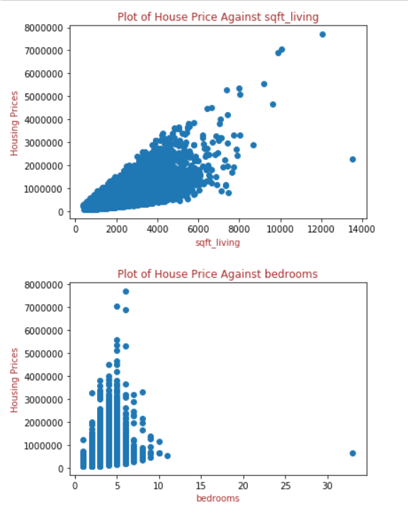

# King County Home Remodeling

Author: James Stipanowich

## Project Overview

Every year homes are bought and sold in the Washington state area. Seattle, one of the largest cities in Washington state, belongs to a county named King County. The buying and selling of houses occurs every year in King County in the state of Washington. The housing price values are recorded and may vary over many thousands and millions of dollars. The worth of a house may depend on many different factors including square footage, number of bedrooms, number of bathrooms, and number of floors of a home. Regression modeling is implemented to analyze house sales in King County and inform a home seller how to sell a home with the greatest net worth possible.

## Business Problem

In this housing project, I am acting with a real estate agency in the King County area of Washington state. The real estate agency wants to help homeowners determine the best ways to improve their homes and enhance the estimated value of their homes in preparation for putting them on the market to be sold. I plan to help homeowners come up with the best ideas for home renovations to increase the worth of their homes and allow homeowners to sell their homes for the highest monetary value possible.

### The Data

This project uses the King County House Sales dataset, which can be found in  `kc_house_data.csv` in the data folder in this repo. The description of the column names can be found in `column_names.md` in the same folder. The dataset covers house sale prices between May 2014 and May 2015 in King County of Washington state.

I decide what data from this dataset to use and how to use it. 

## Data Preparation

Factors that influence how well a house might sell in King County include square footage of a home, number of bedrooms, number of bathrooms, and number of floors of a home. I use these specific home aspects from the King County House Sales dataset because they are all variables that can be realistically constructed or deconstructed in order to improve the selling price of a home. I created graphs of the relationships between these attributes of homes in King County and the sale prices of the homes in King County they related to in order to connect how home sale price and the various attributes affect one another. The graphs are shown below:

The graphs showed that the relationships between these various features of a home and home sale price are on different scales. Each of these home variables links with the home sale price in a unique way.

## Data Modeling

In order to take into account square footage, number of bedrooms, number of bathrooms, and number of floors of a home on a collective scale with a more specified affiliation with home sale price I created a model including all of these aspects of home sales and compared the various model features with home selling price.

My initial model used square footage, number of bedrooms, number of bathrooms, and number of floors of a home as they existed unchanged in the dataset and only took in 51 percent of the King County House Sales data from the dataset because square footage, number of bedrooms, number of bathrooms, and number of floors of a home all had very different relationships with sale price of a home. My baseline model included a lot of outlier data that may have strongly skewed the relationships between the various features of square footage, number of bedrooms, number of bathrooms, and number of floors of a home and home selling price. 

I decided to create a second model that mitigated the outlier data. I changed the number of bedrooms and bathrooms per house to less than or equal to 6. This data represents single family households. I altered the number of floors in the data to only include houses with three floors or less. I reinstated a new home selling price ceiling to only include homes whose initial home price value was within two standard deviations of the mean home price value as well. The changes I made allowed my new model to only account for 7.75 percent of the King County House Sales data.

## Conclusions

- Create more square foot living space and less bedrooms.

- Allow more variance with number of bathrooms and number of floors because the relationship of these variables change less with relation to home sale price.

- Expect an average home price value of $541284 or $486201 depending on choice of model.

## Recommendations for Further Analysis

- Create more models with different data cleaning tactics on bedrooms to find a positive correlation value for bedrooms in relation to home selling price.

- Include more specified square footage columns from original King County House Sales dataset in new models to attain other square footage values when compared with home selling price. Look at square foot of the lot where it is different from square footage of a home. Procure information about square foot living of a house with or without a basement.

## For More Information

See the full analysis of my findings in...

Contact me at jmstipanowich@gmail.com

## Repository Structure

